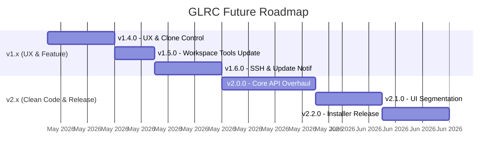

# GLRC — Roadmap Versi

## Konvensi Versioning: `x.y.z`

| Segmen | Nama | Kapan Dinaikkan | Contoh |
|---|---|---|---|
| **x** | **MAJOR** | Perubahan arsitektur besar, breaking changes, atau rewrite signifikan | `1.x.x` → `2.0.0` |
| **y** | **MINOR** | Fitur baru atau peningkatan substansial, backward-compatible | `2.0.x` → `2.1.0` |
| **z** | **PATCH** | Perbaikan bug, hotfix, koreksi kecil — tidak ada fitur baru | `1.3.0` → `1.3.1` |

---

## 📜 Riwayat Rilis (Telah Rampung)

| Versi | Rilis | Ringkasan Perubahan |
|---|---|---|
| **v1.0.0** | Awal | Rilis perdana core fungsionalitas clone dan GUI dasar. |
| **v1.1.0** | Minor | Penambahan integrasi _pagination_ dan search. |
| **v1.2.0** | Minor | Peningkatan sistem autentikasi. |
| **v1.2.1** | Patch | Optimasi UI dan bugfix kredensial. |
| **v1.2.2** | Patch | *Hardening* — Validasi URL, deteksi biner `git`, perbaikan exception. |
| **v1.2.3** | Patch | *i18n & Constants* — Pelengkapan lokalisasi seluruh bahasa dan perbaikan *magic numbers*. |
| **v1.3.0** | Minor | *Cross-Platform & Security* — Menghapus DPAPI, migrasi `keyring`, dan struktur config baru. |
| **v1.3.1** | Patch | *Hotfix* — PyInstaller `keyrings.alt` bundling, *absolute pathing*, dan sinkronisasi ikon modal. |
| **v1.3.2** | Patch | *Documentation Shift* — Perombakan dokumen menjadi ekosistem dwibahasa & bahasa IT sehari-hari. |
| **v1.4.0** | Minor | *UX & Clone Control* — Silent clone, Workspace Tools (Generate/Export/Import), Disk Validation, dan fitur Bulk Apply branch. |
| **v1.4.1** | Patch | *Startup Hotfix* — Memperbaiki crash startup akibat referensi tombol export lama setelah Workspace Tools dipindahkan ke modal. |
| **v1.4.2** | Patch | *Workspace Tools Stability* — Menstabilkan modal/focus, mencegah UI terkunci, dan mengamankan callback dari background thread. |
| **v1.4.3** | Patch | *UI Hotfix* — Menghilangkan flickering pada ikon modal melalui immediate apply tanpa timer. |
| **v1.4.4** | Patch | *Hotfix* — Memperbaiki AttributeError pada fungsi Generate Workspace. |
| **v1.4.5** | Patch | *Branch Configuration Selection Hotfix* — Memastikan modal branch memakai snapshot repo terpilih dan mengabaikan render halaman stale. |
| **v1.5.0** | Minor | *Workspace Tools Maturation* — Menambahkan fitur Find & Replace, auto-format & clean text, dan pre-validation preview. |

---

## 📋 Peta Rilis Selanjutnya

---

## 🛠️ v1.5.1 — UX & Navigasi
> **Tipe: PATCH** — Peningkatan kenyamanan navigasi dan antarmuka.

| # | Item | Status |
|---|---|---|
| 1 | **Recent Workspaces** — Menambahkan menu "Recent" di modal Workspace Tools untuk memuat ulang 5-10 file terakhir. | ⚪ Pending |
| 2 | **Auto-Detect IDE** — Deteksi otomatis IDE populer (VS Code, Cursor, PyCharm, Sublime) dalam pilihan dropdown. | ⚪ Pending |
| 3 | **System Theme Sync** — Sinkronisasi tema aplikasi (Dark/Light) otomatis mengikuti pengaturan sistem. | ⚪ Pending |

---

## 🛠️ v1.5.2 — Efisiensi & Storage
> **Tipe: PATCH** — Optimasi penggunaan ruang disk dan informasi pasca-sinkronisasi.

| # | Item | Status |
|---|---|---|
| 1 | **Shallow Clone Toggle** — Opsi `--depth 1` di Settings untuk menghemat kuota dan ruang disk pada repo besar. | ⚪ Pending |
| 2 | **Post-Pull Summary** — Tampilan ringkasan file berubah atau tombol "View Changes" di IDE setelah operasi Pull. | ⚪ Pending |

---

## 🛠️ v1.5.3 — Keamanan & Maintenance
> **Tipe: PATCH** — Notifikasi keamanan token dan pelacakan riwayat clone.

| # | Item | Status |
|---|---|---|
| 1 | **Token Expiry Warning** — Notifikasi UI jika token akan kedaluwarsa dalam < 24 jam berdasarkan durasi simpan. | ⚪ Pending |
| 2 | **Clone Metadata** — File tersembunyi `.glrc_meta` di folder repo untuk mencatat info asal usul (branch, PAT owner). | ⚪ Pending |

---

## 🛠️ v1.5.4 — Perbaikan Logika
> **Tipe: PATCH** — Penanganan cerdas terhadap konflik struktur folder.

| # | Item | Status |
|---|---|---|
| 1 | **Smart Folder Collision** — Tawarkan opsi "Clean & Clone" jika folder tujuan ada namun isinya bukan folder Git. | ⚪ Pending |

---

## ✨ v1.6.0 — SSH Maturity & Version Update
> **Tipe: MINOR** — Fitur baru: Kematangan infrastruktur SSH dan Notifikasi Update.

| # | Item | Status |
|---|---|---|
| 1 | **SSH key validation** — cek `~/.ssh/id_rsa` atau `id_ed25519` ada sebelum clone SSH | ⚪ Pending |
| 2 | **SSH error feedback** — pesan error khusus jika SSH key tidak ditemukan atau agent tidak running | ⚪ Pending |
| 3 | **Auto-check version** — cek GitHub API `/releases/latest` saat startup, tampilkan notifikasi jika versi baru tersedia | ⚪ Pending |
| 4 | **IDE detection Linux/macOS** — extend `detect_available_ides()` untuk scan PATH (Linux) dan Applications (macOS) | ⚪ Pending |

**Estimasi**: ~3-5 hari

---

## 🚀 v2.0.0 — Core Architecture Overhaul
> **Tipe: MAJOR** — Pembersihan pondasi inti aplikasi (Backend-side) memecah "God Class" pada logika koneksi dan sistem shell file.

| # | Item | Status |
|---|---|---|
| 1 | **Extract: GitLabAPI Class** — Pisahkan semua pemanggilan `requests.get()` menjadi kelas mandiri yang diinjeksi (*Dependency Injection*). | ⚪ Pending |
| 2 | **Extract: GitOperations Class** — Pindahkan seluruh instruksi command `subprocess.run` (Clone, Pull, Checkout) menjadi entitas terpisah. | ⚪ Pending |
| 3 | **Extract Method di _process_single_repo** — Cincang kerumitan error handling menjadi fungsi bertahap (Validasi -> Exec -> Config -> Clean). | ⚪ Pending |

**Estimasi**: ~4-7 hari

---

## 🎨 v2.1.0 — UI Component Segmentation
> **Tipe: MINOR** — Pembersihan pondasi grafis (Frontend-side) untuk mengeliminasi sisa "God Class" pada `main.py`.

| # | Item | Status |
|---|---|---|
| 1 | Pindahkan desain `LoginFrame` ke /src/ui/login.py. | ⚪ Pending |
| 2 | Pindahkan desain `SettingsModal`/`ProfileModal` menjadi object Class independen. | ⚪ Pending |
| 3 | Implementasikan *Callback / Event Emitters* yang menghubungkan UI terpisah dengan Core API. | ⚪ Pending |

**Estimasi**: ~3-5 hari

---

## 🌍 v2.2.0 — Cross-Platform Installers
> **Tipe: MINOR** — Publikasi kemudahan instalasi untuk *End-User*.

| # | Item | Status |
|---|---|---|
| 1 | **Distribusi Resmi Terinstal**: Buat installer `Setup-GLRC.exe` via Inno Setup mendampingi rilis executable portable saat ini. | ⚪ Pending |
| 2 | **Target Cross-Platform Build**: Otomasi penyusunan `.AppImage` (Linux) atau `.dmg` (macOS) di arsitektur CI/CD. | ⚪ Pending |

**Estimasi**: ~3-5 hari

---

## 🌌 Eksplorasi Skala Cloner (Beyond v2.x)
Sesuai haluan utama GLRC yang berstatus mutlak sebagai **GitLab Repo Cloner**, berikut adalah potensi perluasan kekuatan *cloning & pulling* tanpa merusak identitas aplikasi:

| # | Potensi Fitur *Enterprise Cloner* | Penjelasan | Status |
|---|---|---|---|
| 1 | **Sub-Group & Folder Batch Target** | Mengizinkan pengguna mencantumkan link spesifik folder tim (co: `gitlab.com/tim-backend/service/*`). GLRC akan memanen seluruh repositori yang memijak tanah *group* tersebut secara rekursif hanya dengan 1 link grup. | ⚪ Pending |
| 2 | **Cron / Auto-Fetch Sinkron Cepat** | Menyediakan mode pemanggilan UI tersembunyi (*headless mode*). Melalui *Windows Task Scheduler / Linux CronJob*, aplikasi berjalan otomatis jam 3 pagi menarik puluhan data pembaharuan repo, memperbarui status komputer pengguna secara _offline_ tiap hari. | ⚪ Pending |
| 3 | **Smart Template Cloning (Boilerplate Maker)** | Setelah berhasil mengunduh suatu pola repo (misalnya project _template-vuejs_), GLRC akan menambahkan perintah opsi "Buat Menjadi Proyek Kosong" (menghancurkan direktori `.git/` bawaan otomatis). Berfungsi brilian untuk setup awal developer! | ⚪ Pending |
| 4 | **Data Filter & Size Estimation** | Saat mencari puluhan repositori, berikan saringan: *Abaikan repositori di atas 2GB* atau *Sortir repositori yang baru di-update 1 minggu terakhir* untuk menghindari clone yang membengkakkan _hardisk_ karena salah pilih. | ⚪ Pending |
| 5 | **OAuth2 Login (Identity Provider)** | Implementasi login satu tombol via Browser menggunakan alur *Authorization Code Flow with PKCE*. Menghilangkan kebutuhan *copy-paste* PAT secara manual. | ⚪ Pending |

> [!NOTE]
> **Spesifikasi Teknis Registrasi OAuth2 (Tahap 1):**
> - **Nama:** `GLRC: GitLab Repo Cloner`
> - **Redirect URI:** `http://localhost:15842` (Port unik untuk menghindari tabrakan servis lain).
> - **Confidential:** **Uncheck** (Aplikasi desktop adalah *Public Client*).
> - **Scopes:** Centang `api` dan `read_repository`.
> - **Keamanan:** Mendukung GitLab Perusahaan (*Self-hosted*) secara aman melalui protokol OAuth2 standar.
